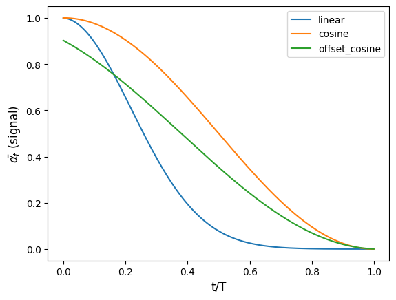
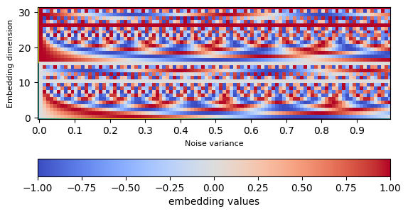
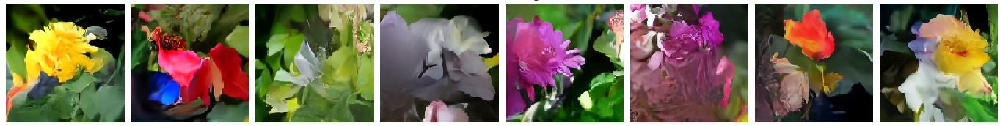

# Flower (128x128) Generator with Diffusion UNET

This project implements a generative model based on the UNET architecture coupled with a diffusion process to generate high-quality flower images at a resolution of 128x128 pixels. The diffusion process helps in generating coherent and realistic images by gradually denoising noisy images.

## Model Architecture
- The architecture employs residual blocks for efficient learning of deep networks by using skip connections.
- It utilizes downsample and upsample blocks to extract hierarchical features and reconstruct images.
- A diffusion model removes noise iteratively by predicting and subtracting noise levels.
- An Exponential Moving Average (EMA) model stabilizes training by maintaining a smoothed version of the main model's weights.

### Performance Comparison

- During experimentation, it was observed that increasing the image resolution from 64x64 to 128x128 led to a significant increase in training time.
- With 64x64 images, the model achieved an epoch duration of approximately 2 minutes, while doubling the resolution to 128x128 resulted in an epoch duration of around 8 minutes.
- This increase in training time highlights the computational cost associated with higher image resolutions.

## Diffusion Process
- The diffusion process is a technique used to denoise images progressively by iteratively applying a sequence of noise-reducing transformations. 
- It involves simulating the spread of noise in the image space and gradually removing it to reveal the underlying structure. In this project, various diffusion schedules, including linear, cosine, and offset cosine, are explored to determine the most effective denoising strategy.

## Offset cosine diffusion schedule
- The offset cosine diffusion schedule is a function used in the diffusion process to gradually reduce noise variance by following a cosine curve with an offset. 
- This function ensures smoother diffusion of noise, leading to more stable and coherent denoised images. 

## Sinusoidal Embedding
- The sinusoidal embedding function is utilized for positional encoding, similar to the mechanism used in Transformer models.
- It converts a scalar value representing noise variance into a sinusoidal waveform, allowing the model to learn positional information along different dimensions.
- This helps the model better capture spatial relationships within the input data. 

## Results
- The generated images showcase the effectiveness of the diffusion UNET model in generating high-quality flower images.
- As the diffusion steps progress, the noisy input images gradually transform into more coherent and visually appealing outputs.
- The generated images demonstrate the model's ability to capture fine details and textures while preserving the overall structure of the flowers. 

## Acknowledgements

- This project's idea is inspired by the concepts presented in the "Generative Deep Learning" [book](https://github.com/davidADSP/Generative_Deep_Learning_2nd_Edition/tree/main).
- We express our gratitude to the authors and contributors of the book for their insightful exploration of generative models and their applications.
- Their work serves as a valuable resource and foundation for this project.
- We also acknowledge the use of the [Oxford 102 Flower dataset](https://www.kaggle.com/c/oxford-102-flower-pytorch), which provided the image data used for training and evaluation in this project.
## License

This project is licensed under the MIT License - see the [LICENSE](LICENSE) file for details.
